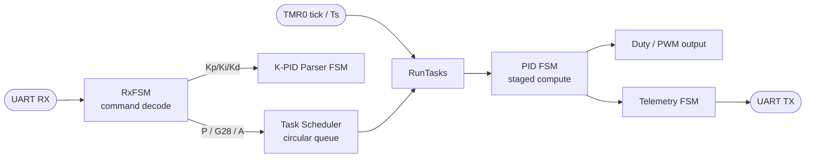

# Rotational Actuator — Digital PID Position Control

Closed-loop position control of a DC motor + quadrature encoder on a **PIC18F46K42**,
with a fully **non-blocking, FSM-driven firmware architecture** and a serial command
protocol for set-point control and live PID tuning.


---

## Overview

A digital PID controller that drives a rotational actuator to a commanded angular
position over a serial link. The firmware runs as a **cooperative super-loop** — no
RTOS — where every long operation is broken into a state machine so the main loop
never blocks. The control law, the command parser, and the telemetry channel all
advance one step per loop iteration, keeping the system responsive to new commands
even mid-motion.

**Reported lab results:** sampling at `Fs = 125 Hz`, steady-state error `< 1°`,
settling in `< 50 samples`, validated against a Simulink model.

---

## Highlights

- **Non-blocking architecture** — three coordinated FSMs (reception, PID compute,
  K-tuning parser) plus a task scheduler share a single super-loop; nothing busy-waits.
- **Staged PID pipeline** — the controller is computed across discrete stages
  (read → error → P → I → D → saturate → duty), each advancing on a timer tick, with
  early-exit saturation to skip unnecessary work once the output clamps.
- **Live tuning over serial** — `Kp`, `Ki`, `Kd` can be updated at runtime through a
  character-by-character parser that supports decimals, with a guard that blocks gain
  changes while a motion task is running.
- **G-code-style command protocol** — compact ASCII commands for set-point, homing,
  and mode switching.
- **Cooperative task scheduler** — a circular queue dispatches motion tasks (`GoTo`,
  `GoHome`) one iteration at a time, bounded to a fixed number of iterations per task.
- **Streaming telemetry** — set-point, position, error and control output are pushed
  back over UART every sample for plotting/identification.

---

## System Architecture



The main loop services, in order: command reception, gain parsing, and — once per
timer period (`Ts`) — one iteration of the active task plus one telemetry frame.

---

## Serial Command Protocol

| Command | Action |
|---|---|
| `S` | Enable **digital** (closed-loop) mode |
| `A` | Switch to analog/open mode and return to zero |
| `P<value>` | Set target position, range `-14500 … 14500` |
| `G28` | Home — set position reference to zero |
| `Kp<value>` | Update proportional gain (decimals via `,`) |
| `Ki<value>` | Update integral gain |
| `Kd<value>` | Update derivative gain |

Gain commands are ignored while a motion task is in progress, to avoid changing the
control law mid-trajectory.

---

## Control Pipeline

The PID is evaluated as a state machine, one stage per call:

| Stage | Operation |
|---|---|
| `LECTURA` | Read encoder pulses → angular position |
| `ERROR` | `error = setpoint − position` |
| `P` | Proportional term (+ early saturation) |
| `I` | Integral term over accumulated error (+ early saturation) |
| `D` | Derivative of error |
| `SALIDA` | Clamp control effort and scale |
| `DUTY` | Emit bounded duty command, publish telemetry |

The control effort is clamped (`±24`) before being scaled to a bounded duty value,
preventing actuator overdrive and integrator wind-up from saturating the output.

---

## Hardware

- **MCU:** PIC18F46K42
- **Feedback:** quadrature encoder (interrupt-driven pulse counting)
- **Actuator:** DC motor driven through an H-bridge / driver stage
- **Custom PCB** for the controller and power stage
- **Host link:** UART serial (commands in, telemetry out)

> Peripheral configuration (UART1, TMR0, pins, interrupts) is generated with
> **Microchip Code Configurator (MCC)**.

---

## Repository Structure

```
.
├── main.c                     # Application: FSMs, PID, scheduler, protocol
├── mcc_generated_files/       # MCC peripheral drivers (UART, TMR0, system, pins)
└── *.X                        # MPLAB X project files
```

---

## Build & Flash

1. Open the project in **MPLAB X IDE**.
2. Regenerate peripherals with **MCC** if needed.
3. Build with the **XC8** compiler.
4. Flash with a PICkit / compatible programmer.
5. Open a serial terminal at the configured baud rate and send commands
   (e.g. `S`, then `P1000`).

---

## Author

**Juan Pablo Arenas** — Mechatronics Engineering, Pontificia Universidad Javeriana
[GitHub @Fellbowl](https://github.com/Fellbowl)
